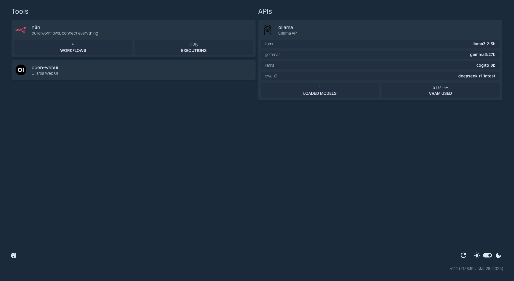

# AI Starterkit (Docker)



## Included Tools

- [GetHomepage](https://gethomepage.dev/): customizable application dashboard
- [n8n](https://n8n.io/): workflow automation tool
- [Open WebUI](https://github.com/open-webui/open-webui): web-based UI for AI models
- [Ollama](https://ollama.com/): local LLMs (does not support GPU acceleration on MacOS, use ollama via homebrew instead)

## Setup

### Install Docker Desktop
   - [Docker Desktop for Mac](https://www.docker.com/products/docker-desktop/)
   - [Docker Desktop for Windows](https://www.docker.com/products/docker-desktop/)
   - [Docker Desktop for Linux](https://docs.docker.com/desktop/install/linux-install/)

### Clone the repository
   ```bash
   git clone https://github.com/mashb1t/ai-starterkit-docker.git
   cd ai-starterkit-docker
   ```

### Modify environment variables
   - create a `.env` file in the root directory of the project
   - copy the contents of `.env.example` to `.env`
   - modify the values as needed

> [!NOTE]
> If you have not used your GPU with Docker before, please follow the
> [Ollama Docker instructions](https://github.com/ollama/ollama/blob/main/docs/docker.md).

### For Nvidia GPU users

```
docker compose --profile gpu-nvidia up -d
```

### For AMD GPU users

```
docker compose --profile gpu-amd up -d
```

### For Mac / Apple Silicon users

If you’re using a Mac with an M1 or newer processor, you can't expose your GPU
to the Docker instance, unfortunately. There are two options in this case:

1. Run the starter kit fully on CPU, like in the section "For everyone else"
   below
2. Run Ollama on your Mac for faster inference, and connect to that from the
   n8n instance

If you want to run Ollama on your mac, check the
[Ollama homepage](https://ollama.com/)
for installation instructions, and run the starter kit as follows:

```
docker compose up -d
```

### For Mac users running OLLAMA locally

See install instructions below.

```bash
docker compose up -d
```

Then run either `ollama serve` or the ollama app to start the server.

### For everyone else

```
docker compose --profile cpu up -d
```

## Open Dashboard

Open your browser and go to [http://localhost:3000](http://localhost:3000) to access the dashboard.


## Update Tools

To update all tools, you can use the following commands:

```bash
docker-compose pull
```

## Install Ollama (optional, best for MacOS users)
### ollama app
Download from the [ollama website](https://ollama.com/download)

### OR Install via homebrew (MacOS only)

1. install brew if not already installed
2. install ollama via homebrew
    ```bash
    brew install ollama
    ```

3. verify the installation
    ```bash
    ollama -v
    ```

4. start ollama server
    ```bash
    ollama serve
    ```

5. pull a LLM, e.g. llama3.2
    ```bash
    ollama pull llama3.2:3b
    ```

## Set up n8n widget
To display statistics such as workflow count and execution count, you can follow these steps:

1. copy file from copy_me_to_workflows_once/homepage-widget.json to workflows/homepage-widget.json
2. docker compose up -d
3. delete file workflows/homepage-widget.json
4. go to ... > Settings > n8n API, create a new key, copy to clipboard
5. create new credential "homepage-widget", type: n8n, API Key: value from before, URL: http://127.0.0.1:5678/api/v1
6. adjust workflow, use credential "homepage-widget", save and set active
7. uncomment widget in services.yaml
8. reload localhost:3000