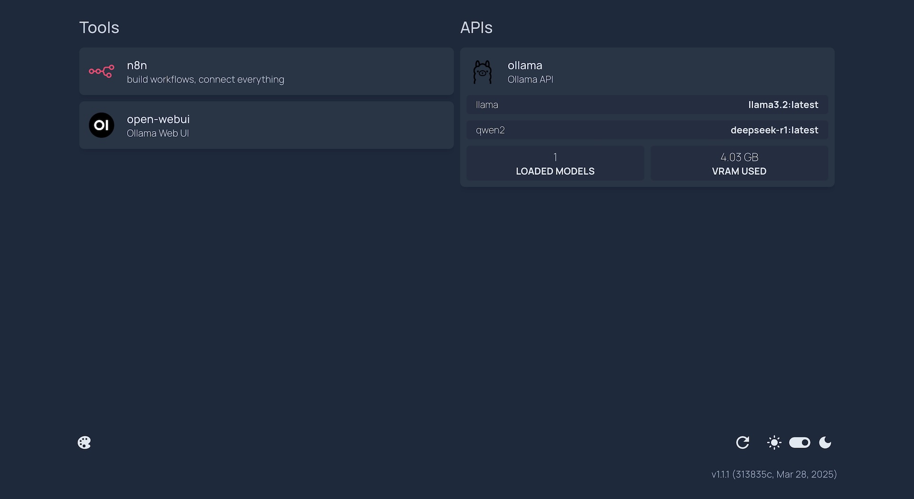

# AI Starterkit (Docker)



## Included Tools

- [GetHomepage](https://gethomepage.dev/): customizable application dashboard
- [n8n](https://n8n.io/): workflow automation tool
- [Open WebUI](https://github.com/open-webui/open-webui): web-based UI for AI models
- [Ollama](https://ollama.com/): local LLMs (does not support GPU acceleration on MacOS, use ollama via homebrew instead)

## Setup

1. install Docker Desktop
   - [Docker Desktop for Mac](https://www.docker.com/products/docker-desktop/)
   - [Docker Desktop for Windows](https://www.docker.com/products/docker-desktop/)
   - [Docker Desktop for Linux](https://docs.docker.com/desktop/install/linux-install/)

2. modify environment variables
   - create a `.env` file in the root directory of the project
   - copy the contents of `.env.example` to `.env`
   - modify the values as needed

3. Install ollama
   * MacOS? See installation of ollama below.

4. start containers
   ```bash
   docker-compose up -d
   ```

## Update Tools

To update all tools, you can use the following commands:

```bash
docker-compose pull
docker-compose up -d
```

## install ollama  (full GPU acceleration support on MacOS)
Docker does only support CPU acceleration on MacOS (no Metal interface yet for GPU), so if you want to use ollama with GPU acceleration, you need to install it natively.

### Install ollama MacOS app
Download from the [ollama website](https://ollama.com/download)

### OR Install via homebrew (MacOS only)

1. install brew if not already installed
2. install ollama via homebrew
    ```bash
    brew install ollama
    ```

3. verify the installation
    ```bash
    ollama -v
    ```
4. start ollama server
    ```bash
    ollama serve
    ```

## Run

Open your browser and go to [http://localhost:3000](http://localhost:3000) to access the dashboard.
